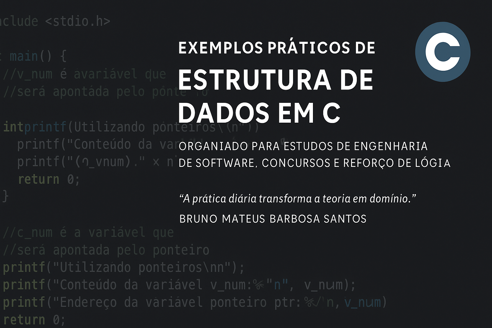

# Exemplos de Estrutura de Dados em C - Engenharia de Software (Estácio)




Este repositório contém exemplos práticos em linguagem **C** para fixação dos conceitos de **Estrutura de Dados**, desenvolvidos durante meus estudos na graduação em Engenharia de Software (Estácio).

Os exemplos abordam:
✅ Ponteiros em C  
✅ Uso de `struct` e `typedef`  
✅ `struct` aninhadas  
✅ Vetores de `struct`  
✅ Boas práticas de inicialização e manipulação de dados em C

---

## 📚 Conteúdo

### ✅ Alocação e Vetores

alocacao_dinamica.c: Alocação dinâmica em C.

alocacao_sequencial.c: Alocação sequencial em C.

### ✅ Busca

busca_binaria.c: Busca binária recursiva.

busca_lista_encadeada_ordenada.c: Busca em lista encadeada ordenada.

busca_sequencial.c: Busca sequencial simples.

### ✅ Listas Encadeadas

lista_encadeada_no_simples.c: Definição de nó simples.

lista_simplesmente_encadeada_no.c: Lista simplesmente encadeada.

lista_duplamente_encadeada_no.c: Lista duplamente encadeada.

insercao_lista_encadeada.c: Inserção em lista encadeada.

remocao_lista_encadeada.c: Remoção em lista encadeada.

### ✅ Pilhas

pilha_push.c: Empilhamento em pilha estática.

pilha_pop.c: Desempilhamento em pilha estática.

pilha_encadeada_push.c: Empilhamento em pilha encadeada.

pilha_encadeada_pop.c: Desempilhamento em pilha encadeada.

### ✅ Filas

fila_enfileirar.c: Enfileirar em fila estática circular.

fila_desenfileirar.c: Desenfileirar em fila estática circular.

fila_encadeada_enfileirar.c: Enfileirar em fila encadeada.

fila_encadeada_desenfileirar.c: Desenfileirar em fila encadeada.

### ✅ Ordenação

ordenacao_por_distribuicao.c: Ordenação por distribuição (Radix Sort).

### ✅ Exemplos com Structs e Ponteiros

c-pointers-basic-example.c: Uso básico de ponteiros.

c-variable-allocation-examples.c: Exemplos de alocação de variáveis.

c-struct-aluno-example.c: Cadastro de alunos usando structs.

c-struct-aluno-cadastro.c: Cadastro completo de alunos.

c-structs-aninhadas-datas-aluno.c: Struct aninhada para datas em cadastro.

c-structs-aninhadas-funcionario.c: Structs aninhadas para cadastro de funcionários.

c-typedef-structs-aninhadas.c: Uso de typedef e structs aninhadas.

c-typedef-structs-aninhadas-mult.c: Struct aninhada com múltiplos alunos.

c-vetor-struct-alunos.c: Vetores de structs para alunos.


## 🚀 Como compilar

Utilize `gcc` para compilar os exemplos:

```bash
gcc nome-do-arquivo.c -o nome-executavel
./nome-executavel

✍️ Autor
Bruno Mateus Barbosa Santos
Estudante de Engenharia de Software e entusiasta de Estrutura de Dados e Algoritmos.

“O sucesso é a soma de pequenos esforços repetidos dia após dia.” – Robert Collier

⭐ Contribuições
Este repositório é utilizado para meus estudos, mas sugestões de melhorias são sempre bem-vindas!
